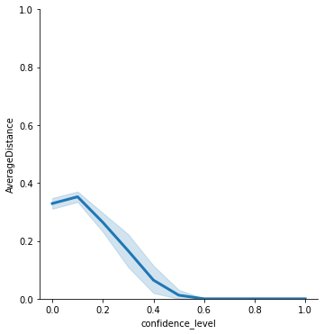
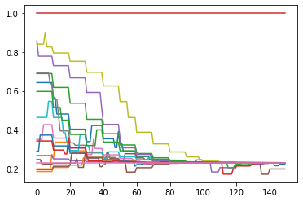
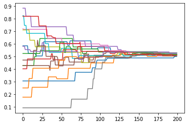

(last updated: March 14th, 2021)

Introduction to ``defSim``
==========================

This short tutorial explains the basic functionality of defSim. First,
we show the two main functions that create a single simulation run or a
full experiment as a set of simulation runs with different parameter
settings. The arguments are used to call a number of modules that are
already implemented in defSim and can be combined to create a unique
experiment. Then, we show the more modular use of defSim, where the
modules are used independently or modified and fed back into the
Simulation or Experiment classes.

1. `‘Out of the box’ use <#1.-Out-of-the-box-use>`__
2. `Modular use <#2.-Modular-use>`__

--------------

1. Out of the box use
---------------------

Using ``defSim`` ‘out of the box’ is the go-to use for quick
replications, to illustrate well-known model dynamics, and for teaching
purposes. All modules of defSim are called automatically, using
reasonable default values or user specified parameters. There are two
classes available for using defSim in this way: the
```Simulation`` <https://defsim.github.io/defSim/simulation.class.html>`__
class and the
```Experiment`` <https://defsim.github.io/defSim/experiment.class.html>`__
class. The Simulation class is used to specify a single simulation run,
whereas the Experiment takes lists of parameter values to create a
simulation experiment with a user-specified number of replications per
parameter combination.

First, we import defSim and a couple other useful packages.

.. code:: ipython3

    import defSim as ds
    
    import networkx as nx              # used to handle the networkX object
    import matplotlib.pyplot as plt    # for plotting
    import numpy as np                 # includes some useful math tools
    import random                      # used to set seeds for random but replicable drawing
    import pandas as pd                # data manipulation

Then, we define a single simulation run, using the Simulation class

.. code:: ipython3

    simrun = ds.Simulation()

The simulation object will run, even without specifying any arguments.
It uses a long list of default values, which can be viewed using the
class specific method ``return_values``.

.. code:: ipython3

    simrun.return_values()


.. raw:: html

    <div>
    <style scoped>
        .dataframe tbody tr th:only-of-type {
            vertical-align: middle;
        }
    
        .dataframe tbody tr th {
            vertical-align: top;
        }
    
        .dataframe thead th {
            text-align: right;
        }
    </style>
    <table border="1" class="dataframe">
      <thead>
        <tr style="text-align: right;">
          <th></th>
          <th>network</th>
          <th>topology</th>
          <th>network_modifiers</th>
          <th>attributes_initializer</th>
          <th>focal_agent_selector</th>
          <th>neighbor_selector</th>
          <th>influence_function</th>
          <th>influenceable_attributes</th>
          <th>communication_regime</th>
          <th>dissimilarity_calculator</th>
          <th>...</th>
          <th>seed</th>
          <th>network_provided</th>
          <th>agentIDs</th>
          <th>time_steps</th>
          <th>influence_steps</th>
          <th>output_realizations</th>
          <th>output_folder_path</th>
          <th>output_file_types</th>
          <th>tickwise</th>
          <th>tickwise_output_step_size</th>
        </tr>
      </thead>
      <tbody>
        <tr>
          <th>0</th>
          <td>None</td>
          <td>grid</td>
          <td>None</td>
          <td>random_categorical</td>
          <td>random</td>
          <td>random</td>
          <td>similarity_adoption</td>
          <td>None</td>
          <td>one-to-one</td>
          <td>&lt;defSim.dissimilarity_component.HammingDistanc...</td>
          <td>...</td>
          <td>None</td>
          <td>False</td>
          <td>[]</td>
          <td>0</td>
          <td>0</td>
          <td>[]</td>
          <td>None</td>
          <td>[]</td>
          <td>[]</td>
          <td>1</td>
        </tr>
      </tbody>
    </table>
    <p>1 rows × 22 columns</p>
    </div>


Let’s modify the object a little, to deviate from the default
simulation, and run a simple bounded confidence model using a
one-dimensional initially randomly distributed continuous opinion, on a
complete graph network.

.. code:: ipython3

    simrun = ds.Simulation(
        seed=555,                                    # seed for replicability
        attributes_initializer="random_continuous",  # continuous opinion with random start value
        dissimilarity_measure="euclidean",           # distance calculator
        topology="complete_graph",                   # graph where all agents are connected
        influence_function="bounded_confidence",     # influence until dissimilarity > confidence
        max_iterations=1000,                         # simulation stops after this # of ticks
        parameter_dict={                             # dictionary for all arguments passed to modules
            'n':20,                                  # size of the network
            'num_features':1,                        # number of opinion features agents posess
            'confidence_level':.8,                   # bounded confidence threshold value
            'convergence_rate':.5                    # distance the receiver moves towards the sender
        })
    results = simrun.run()


.. parsed-literal::

    /usr/local/lib/python3.9/site-packages/defSim/agents_init/agents_init.py:165: UserWarning: No Numpy Generator in parameter dictionary, creating default
      warnings.warn("No Numpy Generator in parameter dictionary, creating default")
    100%|██████████| 1000/1000 [00:00<00:00, 2177.03it/s]


.. raw:: html

    <div>
    <style scoped>
        .dataframe tbody tr th:only-of-type {
            vertical-align: middle;
        }
    
        .dataframe tbody tr th {
            vertical-align: top;
        }
    
        .dataframe thead th {
            text-align: right;
        }
    </style>
    <table border="1" class="dataframe">
      <thead>
        <tr style="text-align: right;">
          <th></th>
          <th>Seed</th>
          <th>Ticks</th>
          <th>SuccessfulInfluence</th>
          <th>Topology</th>
          <th>n</th>
          <th>num_features</th>
          <th>confidence_level</th>
          <th>convergence_rate</th>
          <th>np_random_generator</th>
          <th>Regions</th>
          <th>Zones</th>
          <th>Homogeneity</th>
          <th>AverageDistance</th>
          <th>AverageOpinionf01</th>
        </tr>
      </thead>
      <tbody>
        <tr>
          <th>0</th>
          <td>555</td>
          <td>1000</td>
          <td>998</td>
          <td>complete_graph</td>
          <td>20</td>
          <td>1</td>
          <td>0.8</td>
          <td>0.5</td>
          <td>Generator(PCG64)</td>
          <td>20</td>
          <td>1</td>
          <td>0.05</td>
          <td>3.411821e-08</td>
          <td>0.442595</td>
        </tr>
      </tbody>
    </table>
    </div>


The simulation gives a pandas data frame as output, which we can print.

.. code:: ipython3

    print(simrun)


.. parsed-literal::

         index   Seed  Ticks  SuccessfulInfluence        Topology   n  \
    0        0  35342   1000                    0  complete_graph  20   
    1        0  45985   1000                    0  complete_graph  20   
    2        0  31109   1000                    0  complete_graph  20   
    3        0  26800   1000                    0  complete_graph  20   
    4        0  83560   1000                    0  complete_graph  20   
    ..     ...    ...    ...                  ...             ...  ..   
    105      0  75306   1000                 1000  complete_graph  20   
    106      0  26744   1000                 1000  complete_graph  20   
    107      0  44321   1000                 1000  complete_graph  20   
    108      0  31496   1000                 1000  complete_graph  20   
    109      0  74249   1000                 1000  complete_graph  20   
    
         num_features communication_regime  confidence_level  convergence_rate  \
    0               1           one-to-one               0.0               0.5   
    1               1           one-to-one               0.0               0.5   
    2               1           one-to-one               0.0               0.5   
    3               1           one-to-one               0.0               0.5   
    4               1           one-to-one               0.0               0.5   
    ..            ...                  ...               ...               ...   
    105             1           one-to-one               1.0               0.5   
    106             1           one-to-one               1.0               0.5   
    107             1           one-to-one               1.0               0.5   
    108             1           one-to-one               1.0               0.5   
    109             1           one-to-one               1.0               0.5   
    
          seed np_random_generator  Regions  Zones  Homogeneity  AverageDistance  \
    0    35342    Generator(PCG64)       20      1         0.05     3.474832e-01   
    1    45985    Generator(PCG64)       20      1         0.05     3.392755e-01   
    2    31109    Generator(PCG64)       20      1         0.05     3.537419e-01   
    3    26800    Generator(PCG64)       20      1         0.05     3.140546e-01   
    4    83560    Generator(PCG64)       20      1         0.05     3.101613e-01   
    ..     ...                 ...      ...    ...          ...              ...   
    105  75306    Generator(PCG64)       20      1         0.05     4.944899e-08   
    106  26744    Generator(PCG64)       20      1         0.05     7.839228e-09   
    107  44321    Generator(PCG64)       20      1         0.05     1.218306e-07   
    108  31496    Generator(PCG64)       20      1         0.05     6.004397e-09   
    109  74249    Generator(PCG64)       20      1         0.05     3.752796e-08   
    
         AverageOpinionf01  
    0             0.563075  
    1             0.502311  
    2             0.488703  
    3             0.467109  
    4             0.457217  
    ..                 ...  
    105           0.337614  
    106           0.496102  
    107           0.428962  
    108           0.655261  
    109           0.565978  
    
    [110 rows x 17 columns]


Now, we may ask a simple question: what is the effect of increasing the
confidence level in the bounded confidence model? The confidence level
is the proportion of dissimilarity that a receiving agent accepts from a
sending agent in order for him to be influenced by the sending agent.

To answer that question, we can run the same model in the Experiment
function. Instead of a float, we pass a list of floats to the
``confidence_level`` parameter. To get a robust estimate of the typical
outcome at each setting, we replicate all our conditions 10 times (for
11 BC threshold values that makes 110 runs in total)

.. code:: ipython3

    experiment = ds.Experiment(
        seed=555,                                    # seed for replicability
        attributes_initializer="random_continuous",  # continuous opinion with random start value
        dissimilarity_measure="euclidean",           # distance calculator
        topology="complete_graph",                   # graph where all agents are connected
        influence_function="bounded_confidence",     # influence until dissimilarity > confidence
        max_iterations=1000,                         # simulation stops after this # of ticks
        network_parameters={                         # dictionary with arguments for 'network_init' module
            'n':20},                                 # size of the network
        attribute_parameters={                       # dictionary with arguments for 'attribute_init' module
            'num_features':1},                       # number of opinion features agents posess
        influence_parameters={                       # dictionary with arguments for 'influence_sim' module
            'confidence_level':[x/10 for x in range(11)],   # list of BC threshold values (0.0 -> 1.0, incr=0.1)
            'convergence_rate':0.5},                 # distance the receiver moves towards the sender
        repetitions=10)                              # number of repetitions per condition
    
    results = experiment.run()


.. parsed-literal::

      0%|          | 0/110 [00:00<?, ?it/s]

.. parsed-literal::

    110 different parameter combinations


.. parsed-literal::

    /usr/local/lib/python3.9/site-packages/defSim/agents_init/agents_init.py:165: UserWarning: No Numpy Generator in parameter dictionary, creating default
      warnings.warn("No Numpy Generator in parameter dictionary, creating default")
    100%|██████████| 110/110 [00:35<00:00,  3.09it/s]


The experiment gave us a pandas data frame with 110 rows:

.. code:: ipython3

    print(results)


.. parsed-literal::

         index   Seed  Ticks  SuccessfulInfluence        Topology   n  \
    0        0  35342   1000                    0  complete_graph  20   
    1        0  45985   1000                    0  complete_graph  20   
    2        0  31109   1000                    0  complete_graph  20   
    3        0  26800   1000                    0  complete_graph  20   
    4        0  83560   1000                    0  complete_graph  20   
    ..     ...    ...    ...                  ...             ...  ..   
    105      0  75306   1000                 1000  complete_graph  20   
    106      0  26744   1000                 1000  complete_graph  20   
    107      0  44321   1000                 1000  complete_graph  20   
    108      0  31496   1000                 1000  complete_graph  20   
    109      0  74249   1000                 1000  complete_graph  20   
    
         num_features communication_regime  confidence_level  convergence_rate  \
    0               1           one-to-one               0.0               0.5   
    1               1           one-to-one               0.0               0.5   
    2               1           one-to-one               0.0               0.5   
    3               1           one-to-one               0.0               0.5   
    4               1           one-to-one               0.0               0.5   
    ..            ...                  ...               ...               ...   
    105             1           one-to-one               1.0               0.5   
    106             1           one-to-one               1.0               0.5   
    107             1           one-to-one               1.0               0.5   
    108             1           one-to-one               1.0               0.5   
    109             1           one-to-one               1.0               0.5   
    
          seed np_random_generator  Regions  Zones  Homogeneity  AverageDistance  \
    0    35342    Generator(PCG64)       20      1         0.05     3.162482e-01   
    1    45985    Generator(PCG64)       20      1         0.05     3.381264e-01   
    2    31109    Generator(PCG64)       20      1         0.05     3.239260e-01   
    3    26800    Generator(PCG64)       20      1         0.05     3.579149e-01   
    4    83560    Generator(PCG64)       20      1         0.05     2.987322e-01   
    ..     ...                 ...      ...    ...          ...              ...   
    105  75306    Generator(PCG64)       20      1         0.05     2.157184e-08   
    106  26744    Generator(PCG64)       20      1         0.05     7.696255e-09   
    107  44321    Generator(PCG64)       20      1         0.05     9.459349e-08   
    108  31496    Generator(PCG64)       20      1         0.05     3.888918e-09   
    109  74249    Generator(PCG64)       20      1         0.05     9.271612e-08   
    
         AverageOpinionf01  
    0             0.549963  
    1             0.604544  
    2             0.441872  
    3             0.433244  
    4             0.543781  
    ..                 ...  
    105           0.529282  
    106           0.615500  
    107           0.578355  
    108           0.375521  
    109           0.472806  
    
    [110 rows x 17 columns]


Using the plotting functionality in defSim (`see
here <https://defsim.github.io/defSim/defSim.tools.Plots.html>`__), we
can quickly create a plot that shows the relationship between confidence
level and the average distance in the plot.

.. code:: ipython3

    plot = ds.RelPlot(ylim=[0,1])
    plot.plot(data=results,x='confidence_level',y="AverageDistance")





--------------

2. Modular use
--------------

defSim consists of six different modules. Some modules take care of
model initialization (``network_init`` & ``agents_init``), while other
modules are called sequentially in a loop (``focal_agent_sim``,
``neighbor_selector_sim`` & ``influence_sim``), until some convergence
criterium is satisfied. The process is visualized in the flow chart
right of this text.

The Simulation class (or its wrapper the Experiment class) calls all of
these modules in the background, but defSim is designed in such a way
that a *modular* use of the package is easy and user-friendly. All
modules take a NetworkX object as in- and output. Writing an extension
is easy, since we can just use this networkx object to manipulate
outside of one of the modules. The best way to extend the functionality
of defSim is to write your extension within the defSim framework. Adding
your own (published) extension to the defSim package is a great way to
transparently share your code and attract attention to your work.

Now, let’s turn to two of these examples. One in which we manipulate the
networkx object, and one in which we write our own module-method.

Example \| Writing your own module implementation \| Two groups attribute initializer
~~~~~~~~~~~~~~~~~~~~~~~~~~~~~~~~~~~~~~~~~~~~~~~~~~~~~~~~~~~~~~~~~~~~~~~~~~~~~~~~~~~~~

The true power of defSim becomes clear when we use custom module
implementations within the defSim framework. All calls to realizations
of a certain module in the ``Simulation`` and ``Experiment`` classes can
be replaced with your own implementation of such a module. To
succesfully pass an implementation, we need to inherit from the abstract
base classes of that particular module.

Let’s show what we mean here with an example.

Say you want to model two groups that each have a different bias in
their opinions at the start of the model. Under what conditions will
these two groups still converge on one position? How quick do they
converge relative to if there weren’t any groups? To answer these
questions we need to code an attribute initializer that will be called
only at the start of the simulation.

We create an attribute initializer called ``MyOwnAI`` for ‘my own
attribute initializer’:

.. code:: ipython3

    class MyOwnAI(ds.AttributesInitializer):
        """
        This attribute initializer creates a group attribute and assigns one of two values (0 / 1) to an agent
        with equal probability. Thereafter, the values for the `num_features' desired features is drawn from a uniform
        distribution. Limits of the uniform distribution are set for each group.
        """
        
        def __init__(self, limits_0 = [0, 1], limits_1 = [0,1]):
            self.limits_0 = limits_0
            self.limits_1 = limits_1
        
        def initialize_attributes(self, network, **kwargs):
            ds.set_categorical_attribute(network, 'group', [0, 1])
            for j in range(kwargs.get('num_features', 1)):
                for i in network.nodes():
                    if network.nodes[i]['group'] == 0:
                        network.nodes[i]['f{:02d}'.format(j+1)] = np.random.uniform(self.limits_0[0], self.limits_0[1])
                    else:
                        network.nodes[i]['f{:02d}'.format(j+1)] = np.random.uniform(self.limits_1[0], self.limits_1[1])

The arguments that are unique to this attribute initializer have to be
set in the ``__init__()`` part of the class. Here, we have specified
defaults for the opinion limits of the two groups ([0,1]), but these
defaults can be overwritten when we call the module later.

The ``initialize_attributes`` part of the code is simple. We set a
categorical attribute (group) randomly, and then initialize a random
opionion from a uniform distribution with limits ``limits_0`` and
``limits_1``.

The new attribute initializer can now be passed to the Simulation class:

.. code:: ipython3

    simobj = ds.Simulation(
        seed = 1414,  
        topology = 'complete_graph', 
        attributes_initializer = MyOwnAI(limits_0 = [0, 0.7], limits_1 = [0.3, 1]),  # here is our implementation
        influence_function = 'bounded_confidence',
        influenceable_attributes = ['f01'],         # important: only f01 can be influenced, not 'group'!
        dissimilarity_measure = 'euclidean',  
        max_iterations = 3000,   
        output_realizations = ['Basic', ds.AttributeReporter('group')],  # basic output is asked, and we also want to get the values for group membership back (for plotting)
        tickwise = ['f01'], 
        parameter_dict = {  
            'n': 100,  
            'num_features': 1,  
            'confidence_level': 0.6,
            'convergence_rate':0.5
        } 
    )

.. code:: ipython3

    results = simobj.run()   # run the model
    
    groups = results['group']   
    color_values = {0: 'blue', 1: 'red'}
    colors = [color_values[group] for group in groups[0]]
    
    ds.DynamicsPlot(colors=colors, linewidth=1, ylim=[0,1]).plot(data=results, y="Tickwise_f01")


.. parsed-literal::

      0%|          | 0/3000 [00:00<?, ?it/s]/usr/local/lib/python3.9/site-packages/defSim/influence_sim/BoundedConfidence.py:38: UserWarning: convergence_rate not specified, using default value 0.5
      warnings.warn("convergence_rate not specified, using default value 0.5")
    100%|██████████| 3000/3000 [00:03<00:00, 879.39it/s]


.. image:: output_20_1.png


The agents neatly align into two groups. This happens based on opinion
distance, but note that group membership is also taken into account when
calculating distance!

Example \| Independent use of modules \| Biased media influence
~~~~~~~~~~~~~~~~~~~~~~~~~~~~~~~~~~~~~~~~~~~~~~~~~~~~~~~~~~~~~~~

In this example we use the modules independently. We introduce a biased
media platform that will randomly influence half the population one
every ten rounds. Agents follow a weighted linear influence function,
which means that they are influenced proportionally to their opinion
similarity to the sending agent. Once opinion distance becomes too
large, influence becomes negative and agents experience a push away from
the source.

Note that this could easily be done inside of the defSim framework, but
we showcase here an easy to understand example of how all the modules
work.

.. code:: ipython3

        # the INITIALIZATION stage (where the NetworkX object is set up)
        
    # we set a random seed to be able to replicate the run
    random.seed(666)
    np.random.seed(666)
    
    # initialization of the network
    ABM = ds.generate_network("grid",num_agents=20)
    ds.initialize_attributes(ABM, realization="random_continuous", num_features=1)
    
    # here we introduce the biased media agent. An agent connected to all others, with a biased opinion.
    agents = list(ABM.nodes())              # store the original agentset to pass to the agent selectors
    ABM.add_node('biased_media')            # create new node
    ABM.nodes['biased_media']['f01'] = 0.23 # fix the opinion
    for i in agents:                        # add an edge between media source and all other agents
         ABM.add_edge('biased_media',i)
        
    # initialize the dissimilarity calculator (= euclidean in the continuous opinion world)
    calculator = ds.select_calculator("euclidean")
    calculator.calculate_dissimilarity_networkwide(ABM)

.. code:: ipython3

    ## the SIMULATION stage (where we adjust the NetworkX object until convergence)
    
    iterator = 0                       # to count the number of iterations
    opinions_tickwise = []             # to record the opinions at each timestep
    
    while iterator < 200:    # we stop after 200 iterations
        if iterator in [x*10 for x in range(1000)]:    # once every 10 rounds we exert media influence
            ds.spread_influence(
                network = ABM,
                realization = "weighted_linear",     # strong influence between close agents, may be negative when distance is large
                agent_i = 'biased_media',            # the sending agent (i.e. media source)
                agents_j = agents,                   # receiving agents
                regime = "one-to-one",               # communication regime
                dissimilarity_measure = calculator,  # dissimilarity calculator defined above
                homophily=1.5)                       # parameter for the 'weighted_linear' influence module
        else:                          # interaction between agents
            agent_i = ds.select_focal_agent(
                network = ABM,
                realization = "random", # select random agent
                agents=agents)          # agentset to select from
            agent_j = ds.select_neighbors(
                network = ABM,
                realization = "random", # select random neighbor
                focal_agent = agent_i,  # agent who's neighbors are eligible for selection
                regime = "one-to-one")  # communication regime, needed here to tell the selector how many agents to select
            if agent_j == ['biased_media']:        # what if the selected neighbor is the media source? 
                while agent_j == ['biased_media']: # select again if this is the case
                    agent_j = ds.select_neighbors(
                        network = ABM,
                        realization = "random",
                        focal_agent = agent_i,
                        regime = "one-to-one")
            ds.spread_influence(        # exert influence
                network = ABM,
                realization = "weighted_linear",     # strong influence between close agents, may be negative when distance is large
                agent_i = agent_i,                   # the sending agent (i.e. media source)
                agents_j = agent_j,                  # receiving agents
                regime = "one-to-one",               # communication regime
                dissimilarity_measure = calculator,  # dissimilarity calculator defined above
                homophily=1.5)                       # parameter for the 'weighted_linear' influence module
        opinions_tickwise.append(list(nx.get_node_attributes(ABM,'f01').values()))  # store results
        iterator += 1                  # increase iterator

The generated output is stored in ``opinions_tickwise`` – a list of
lists with all agent opinions at each timestep.

We can plot the opinion trajectories using the ``DynamicsPlot`` function
from defSim. This function normally takes a pandas data frame with a
column ``Tickwise_fXX`` generated by the ``tickwise`` output option in
the Simulation or Experiment class. If we pass a data frame with the
opinions_tickwise to the DynamicsPlot function, we can get the same
functionality:

.. code:: ipython3

    plot = ds.DynamicsPlot(fast=True)
    plot.plot(data=pd.DataFrame({'Tickwise_f01':[opinions_tickwise]}), y='Tickwise_f01')





There are a few things to note from these opinion trajectories. As one
might expect, a large number of the agents (90%) converge on the opinion
position of the biased media source. However, in the process, two agents
rejected the stance of the medium and extremized into the other
direction. Occassional meeting with the other agents furthermore create
temporary extremization by others, which is again corrected by the media
source. To compare, let’s look at a single run of the same model without
the media source.

.. code:: ipython3

        # the INITIALIZATION stage (where the NetworkX object is set up)
        
    # we set a random seed to be able to replicate the run
    random.seed(14)
    np.random.seed(14)
    
    # initialization of the network
    ABM = ds.generate_network("grid",num_agents=20)
    ds.initialize_attributes(ABM, realization="random_continuous", num_features=1)
    
    # initialize the dissimilarity calculator (= euclidean in the continuous opinion world)
    calculator = ds.select_calculator("euclidean")
    calculator.calculate_dissimilarity_networkwide(ABM)

.. code:: ipython3

    ## the SIMULATION stage (where we adjust the NetworkX object until convergence)
    
    iterator = 0                       # to count the number of iterations
    opinions_tickwise = []             # to record the opinions at each timestep
    
    while iterator < 200:    # we stop after 200 iterations
        agent_i = ds.select_focal_agent(
            network = ABM,
            realization = "random", # select random agent
            agents=agents)          # agentset to select from
        agent_j = ds.select_neighbors(
            network = ABM,
            realization = "random", # select random neighbor
            focal_agent = agent_i,  # agent who's neighbors are eligible for selection
            regime = "one-to-one")  # communication regime, needed here to tell the selector how many agents to select
        ds.spread_influence(        # exert influence
            network = ABM,
            realization = "weighted_linear",     # strong influence between close agents, may be negative when distance is large
            agent_i = agent_i,                   # the sending agent
            agents_j = agent_j,                  # receiving agent
            regime = "one-to-one",               # communication regime
            dissimilarity_measure = calculator,  # dissimilarity calculator defined above
            homophily=1.5)                       # parameter for the 'weighted_linear' influence module
        opinions_tickwise.append(list(nx.get_node_attributes(ABM,'f01').values()))  # store results
        iterator += 1                  # increase iterator

.. code:: ipython3

    plot = ds.DynamicsPlot(fast=True)
    plot.plot(data=pd.DataFrame({'Tickwise_f01':[opinions_tickwise]}), y='Tickwise_f01')





In this example the agents neatly converge to a central position

--------------

Some useful resources
---------------------

-  `defSim on GitHub <https://github.com/defSim/defSim>`__
-  `defSim documentation <https://defSim.github.io/defSim>`__
