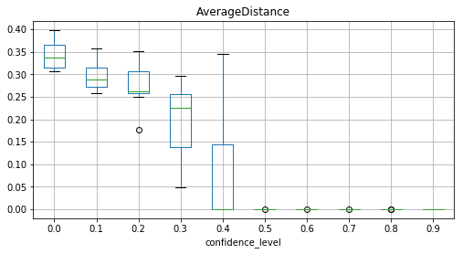
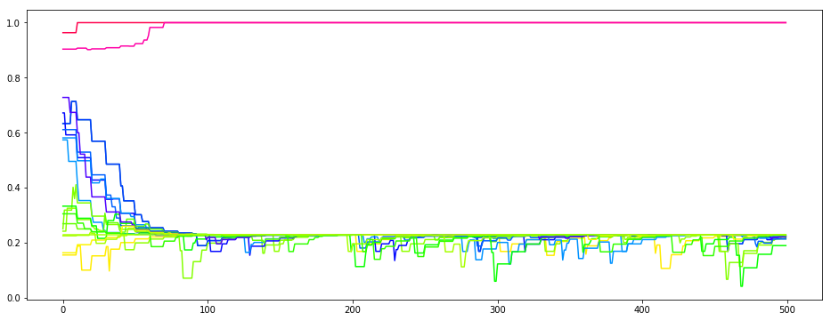
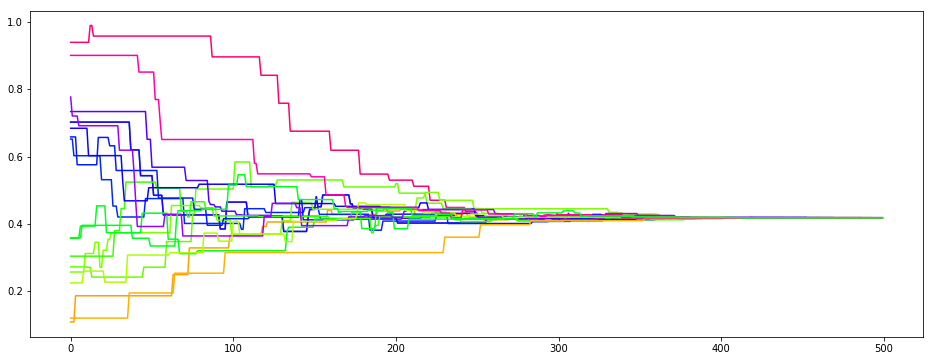

`M. A. Keijzer <https://www.marijnkeijzer.nl>`__ // October 2019 (last
updated: November 14th, 2019)

Introduction to ``defSim``
==========================

This short tutorial explains the two ways in which defSim can be used:

1. `The Unified Way <#1.-The-Unified-Way>`__
2. `The Modular Way <#2.-The-Modular-Way>`__

--------------

1. The Unified Way
------------------

Using ``defSim`` the unified way is the go-to use for quick
replications, to illustrate well-know model dynamics, and for teaching
purposes. All modules of defSim are called automatically, using
reasonable default values or user specified parameters. There are two
classes available for using defSim in this way: the
```Simulation`` <https://marijnkeijzer.github.io/defSim/defSim.html#module-defSim.Simulation>`__
class and the
```Experiment`` <https://marijnkeijzer.github.io/defSim/defSim.html#module-defSim.Experiment>`__
class. The Simulation class is used to specify a single simulation run,
whereas the Experiment takes lists of parameter values to create a
simulation experiment with a user-specified number of replications per
parameter combination.

First, we import defSim and a couple other useful packages.

.. code:: ipython3

    import defSim as ds
    
    import networkx as nx              # used to handle the networkX object
    import matplotlib.pyplot as plt    # for plotting
    import numpy as np                 # includes some useful math tools
    import random                      # used to set seeds for random but replicable drawing

Then, we define a single simulation run, using the Simulation class

.. code:: ipython3

    simrun = ds.Simulation()

The simulation object will run, even without specifying any arguments.
It uses a long list of default values, which can be viewed using the
class specific method ``return_values``.

.. code:: ipython3

    simrun.return_values()


.. raw:: html

    <div>
    <style scoped>
        .dataframe tbody tr th:only-of-type {
            vertical-align: middle;
        }
    
        .dataframe tbody tr th {
            vertical-align: top;
        }
    
        .dataframe thead th {
            text-align: right;
        }
    </style>
    <table border="1" class="dataframe">
      <thead>
        <tr style="text-align: right;">
          <th></th>
          <th>network</th>
          <th>topology</th>
          <th>ms_rewiring</th>
          <th>attributes_initializer</th>
          <th>focal_agent_selector</th>
          <th>neighbor_selector</th>
          <th>influence_function</th>
          <th>influenceable_attributes</th>
          <th>communication_regime</th>
          <th>dissimilarity_calculator</th>
          <th>stop_condition</th>
          <th>max_iterations</th>
          <th>seed</th>
          <th>network_provided</th>
          <th>agentIDs</th>
          <th>time_steps</th>
          <th>influence_steps</th>
          <th>output_realizations</th>
          <th>tickwise</th>
        </tr>
      </thead>
      <tbody>
        <tr>
          <th>0</th>
          <td>None</td>
          <td>grid</td>
          <td>None</td>
          <td>random_categorical</td>
          <td>random</td>
          <td>random</td>
          <td>axelrod</td>
          <td>None</td>
          <td>one-to-one</td>
          <td>&lt;defSim.dissimilarity_component.HammingDistanc...</td>
          <td>max_iteration</td>
          <td>100000</td>
          <td>None</td>
          <td>False</td>
          <td>[]</td>
          <td>0</td>
          <td>0</td>
          <td>[]</td>
          <td>[]</td>
        </tr>
      </tbody>
    </table>
    </div>


Let’s modify the object a little, to deviate from the default
simulation, and run a simple bounded confidence model using a
one-dimensional initially randomly distributed continuous opinion, on a
complete graph network.

.. code:: ipython3

    simrun = ds.Simulation(seed=953,
                           attributes_initializer="random_continuous",
                           dissimilarity_measure="euclidean",
                           topology="complete_graph",
                           influence_function="bounded_confidence",
                           max_iterations=1000,
                           parameter_dict={'n':20,
                           'confidence_level':.8})
    simrun.run_simulation()


.. raw:: html

    <div>
    <style scoped>
        .dataframe tbody tr th:only-of-type {
            vertical-align: middle;
        }
    
        .dataframe tbody tr th {
            vertical-align: top;
        }
    
        .dataframe thead th {
            text-align: right;
        }
    </style>
    <table border="1" class="dataframe">
      <thead>
        <tr style="text-align: right;">
          <th></th>
          <th>AverageDistance</th>
          <th>Homogeneity</th>
          <th>Regions</th>
          <th>Seed</th>
          <th>SuccessfulInfluence</th>
          <th>Ticks</th>
          <th>Topology</th>
          <th>Zones</th>
          <th>confidence_level</th>
          <th>n</th>
        </tr>
      </thead>
      <tbody>
        <tr>
          <th>0</th>
          <td>6.266672e-08</td>
          <td>0.05</td>
          <td>20</td>
          <td>953</td>
          <td>1000</td>
          <td>1000</td>
          <td>complete_graph</td>
          <td>1</td>
          <td>0.8</td>
          <td>20</td>
        </tr>
      </tbody>
    </table>
    </div>


Now, we may ask a simple question: what is the effect of increasing the
confidence level in the bounded confidence model? The confidence level
is the proportion of dissimilarity that a receiving agent accepts from a
sending agent in order for him to be influenced by the sending agent.

.. code:: ipython3

    experiment = ds.Experiment(attributes_initializer="random_continuous",
                               dissimilarity_measure="euclidean",
                               topology="complete_graph",
                               influence_function="bounded_confidence",
                               max_iterations=1000,
                               network_parameters={'n':20},
                               influence_parameters={'confidence_level':[x/10 for x in range(10)]},
                               repetitions=10)
    df = experiment.run()


.. parsed-literal::

    100 different parameter combinations


.. code:: ipython3

    df


.. raw:: html

    <div>
    <style scoped>
        .dataframe tbody tr th:only-of-type {
            vertical-align: middle;
        }
    
        .dataframe tbody tr th {
            vertical-align: top;
        }
    
        .dataframe thead th {
            text-align: right;
        }
    </style>
    <table border="1" class="dataframe">
      <thead>
        <tr style="text-align: right;">
          <th></th>
          <th>index</th>
          <th>AverageDistance</th>
          <th>Homogeneity</th>
          <th>Regions</th>
          <th>Seed</th>
          <th>SuccessfulInfluence</th>
          <th>Ticks</th>
          <th>Topology</th>
          <th>Zones</th>
          <th>communication_regime</th>
          <th>confidence_level</th>
          <th>n</th>
        </tr>
      </thead>
      <tbody>
        <tr>
          <th>0</th>
          <td>0</td>
          <td>3.489535e-01</td>
          <td>0.05</td>
          <td>20</td>
          <td>41415</td>
          <td>0</td>
          <td>1000</td>
          <td>complete_graph</td>
          <td>1</td>
          <td>one-to-one</td>
          <td>0.0</td>
          <td>20</td>
        </tr>
        <tr>
          <th>1</th>
          <td>0</td>
          <td>3.270678e-01</td>
          <td>0.05</td>
          <td>20</td>
          <td>39697</td>
          <td>0</td>
          <td>1000</td>
          <td>complete_graph</td>
          <td>1</td>
          <td>one-to-one</td>
          <td>0.0</td>
          <td>20</td>
        </tr>
        <tr>
          <th>2</th>
          <td>0</td>
          <td>3.119188e-01</td>
          <td>0.05</td>
          <td>20</td>
          <td>33195</td>
          <td>0</td>
          <td>1000</td>
          <td>complete_graph</td>
          <td>1</td>
          <td>one-to-one</td>
          <td>0.0</td>
          <td>20</td>
        </tr>
        <tr>
          <th>3</th>
          <td>0</td>
          <td>3.101983e-01</td>
          <td>0.05</td>
          <td>20</td>
          <td>62135</td>
          <td>0</td>
          <td>1000</td>
          <td>complete_graph</td>
          <td>1</td>
          <td>one-to-one</td>
          <td>0.0</td>
          <td>20</td>
        </tr>
        <tr>
          <th>4</th>
          <td>0</td>
          <td>3.482682e-01</td>
          <td>0.05</td>
          <td>20</td>
          <td>42129</td>
          <td>0</td>
          <td>1000</td>
          <td>complete_graph</td>
          <td>1</td>
          <td>one-to-one</td>
          <td>0.0</td>
          <td>20</td>
        </tr>
        <tr>
          <th>5</th>
          <td>0</td>
          <td>3.074546e-01</td>
          <td>0.05</td>
          <td>20</td>
          <td>80692</td>
          <td>0</td>
          <td>1000</td>
          <td>complete_graph</td>
          <td>1</td>
          <td>one-to-one</td>
          <td>0.0</td>
          <td>20</td>
        </tr>
        <tr>
          <th>6</th>
          <td>0</td>
          <td>3.986280e-01</td>
          <td>0.05</td>
          <td>20</td>
          <td>76742</td>
          <td>0</td>
          <td>1000</td>
          <td>complete_graph</td>
          <td>1</td>
          <td>one-to-one</td>
          <td>0.0</td>
          <td>20</td>
        </tr>
        <tr>
          <th>7</th>
          <td>0</td>
          <td>3.698225e-01</td>
          <td>0.05</td>
          <td>20</td>
          <td>44251</td>
          <td>0</td>
          <td>1000</td>
          <td>complete_graph</td>
          <td>1</td>
          <td>one-to-one</td>
          <td>0.0</td>
          <td>20</td>
        </tr>
        <tr>
          <th>8</th>
          <td>0</td>
          <td>3.847573e-01</td>
          <td>0.05</td>
          <td>20</td>
          <td>15954</td>
          <td>0</td>
          <td>1000</td>
          <td>complete_graph</td>
          <td>1</td>
          <td>one-to-one</td>
          <td>0.0</td>
          <td>20</td>
        </tr>
        <tr>
          <th>9</th>
          <td>0</td>
          <td>3.236729e-01</td>
          <td>0.05</td>
          <td>20</td>
          <td>87972</td>
          <td>0</td>
          <td>1000</td>
          <td>complete_graph</td>
          <td>1</td>
          <td>one-to-one</td>
          <td>0.0</td>
          <td>20</td>
        </tr>
        <tr>
          <th>10</th>
          <td>0</td>
          <td>2.936979e-01</td>
          <td>0.05</td>
          <td>20</td>
          <td>14282</td>
          <td>236</td>
          <td>1000</td>
          <td>complete_graph</td>
          <td>1</td>
          <td>one-to-one</td>
          <td>0.1</td>
          <td>20</td>
        </tr>
        <tr>
          <th>11</th>
          <td>0</td>
          <td>2.812846e-01</td>
          <td>0.05</td>
          <td>20</td>
          <td>29194</td>
          <td>221</td>
          <td>1000</td>
          <td>complete_graph</td>
          <td>1</td>
          <td>one-to-one</td>
          <td>0.1</td>
          <td>20</td>
        </tr>
        <tr>
          <th>12</th>
          <td>0</td>
          <td>2.688736e-01</td>
          <td>0.05</td>
          <td>20</td>
          <td>89726</td>
          <td>246</td>
          <td>1000</td>
          <td>complete_graph</td>
          <td>1</td>
          <td>one-to-one</td>
          <td>0.1</td>
          <td>20</td>
        </tr>
        <tr>
          <th>13</th>
          <td>0</td>
          <td>2.582384e-01</td>
          <td>0.05</td>
          <td>20</td>
          <td>30741</td>
          <td>271</td>
          <td>1000</td>
          <td>complete_graph</td>
          <td>1</td>
          <td>one-to-one</td>
          <td>0.1</td>
          <td>20</td>
        </tr>
        <tr>
          <th>14</th>
          <td>0</td>
          <td>2.685984e-01</td>
          <td>0.05</td>
          <td>20</td>
          <td>30757</td>
          <td>249</td>
          <td>1000</td>
          <td>complete_graph</td>
          <td>1</td>
          <td>one-to-one</td>
          <td>0.1</td>
          <td>20</td>
        </tr>
        <tr>
          <th>15</th>
          <td>0</td>
          <td>2.967415e-01</td>
          <td>0.05</td>
          <td>20</td>
          <td>27921</td>
          <td>165</td>
          <td>1000</td>
          <td>complete_graph</td>
          <td>1</td>
          <td>one-to-one</td>
          <td>0.1</td>
          <td>20</td>
        </tr>
        <tr>
          <th>16</th>
          <td>0</td>
          <td>3.220314e-01</td>
          <td>0.05</td>
          <td>20</td>
          <td>15337</td>
          <td>223</td>
          <td>1000</td>
          <td>complete_graph</td>
          <td>1</td>
          <td>one-to-one</td>
          <td>0.1</td>
          <td>20</td>
        </tr>
        <tr>
          <th>17</th>
          <td>0</td>
          <td>3.434223e-01</td>
          <td>0.05</td>
          <td>20</td>
          <td>18257</td>
          <td>298</td>
          <td>1000</td>
          <td>complete_graph</td>
          <td>1</td>
          <td>one-to-one</td>
          <td>0.1</td>
          <td>20</td>
        </tr>
        <tr>
          <th>18</th>
          <td>0</td>
          <td>3.580273e-01</td>
          <td>0.05</td>
          <td>20</td>
          <td>93839</td>
          <td>170</td>
          <td>1000</td>
          <td>complete_graph</td>
          <td>1</td>
          <td>one-to-one</td>
          <td>0.1</td>
          <td>20</td>
        </tr>
        <tr>
          <th>19</th>
          <td>0</td>
          <td>2.790864e-01</td>
          <td>0.05</td>
          <td>20</td>
          <td>72793</td>
          <td>240</td>
          <td>1000</td>
          <td>complete_graph</td>
          <td>1</td>
          <td>one-to-one</td>
          <td>0.1</td>
          <td>20</td>
        </tr>
        <tr>
          <th>20</th>
          <td>0</td>
          <td>3.504874e-01</td>
          <td>0.05</td>
          <td>20</td>
          <td>23106</td>
          <td>332</td>
          <td>1000</td>
          <td>complete_graph</td>
          <td>1</td>
          <td>one-to-one</td>
          <td>0.2</td>
          <td>20</td>
        </tr>
        <tr>
          <th>21</th>
          <td>0</td>
          <td>2.855730e-01</td>
          <td>0.05</td>
          <td>20</td>
          <td>33388</td>
          <td>404</td>
          <td>1000</td>
          <td>complete_graph</td>
          <td>1</td>
          <td>one-to-one</td>
          <td>0.2</td>
          <td>20</td>
        </tr>
        <tr>
          <th>22</th>
          <td>0</td>
          <td>2.575323e-01</td>
          <td>0.05</td>
          <td>20</td>
          <td>64345</td>
          <td>411</td>
          <td>1000</td>
          <td>complete_graph</td>
          <td>1</td>
          <td>one-to-one</td>
          <td>0.2</td>
          <td>20</td>
        </tr>
        <tr>
          <th>23</th>
          <td>0</td>
          <td>3.129383e-01</td>
          <td>0.05</td>
          <td>20</td>
          <td>19396</td>
          <td>453</td>
          <td>1000</td>
          <td>complete_graph</td>
          <td>1</td>
          <td>one-to-one</td>
          <td>0.2</td>
          <td>20</td>
        </tr>
        <tr>
          <th>24</th>
          <td>0</td>
          <td>3.298730e-01</td>
          <td>0.05</td>
          <td>20</td>
          <td>24840</td>
          <td>323</td>
          <td>1000</td>
          <td>complete_graph</td>
          <td>1</td>
          <td>one-to-one</td>
          <td>0.2</td>
          <td>20</td>
        </tr>
        <tr>
          <th>25</th>
          <td>0</td>
          <td>2.581044e-01</td>
          <td>0.05</td>
          <td>20</td>
          <td>94303</td>
          <td>441</td>
          <td>1000</td>
          <td>complete_graph</td>
          <td>1</td>
          <td>one-to-one</td>
          <td>0.2</td>
          <td>20</td>
        </tr>
        <tr>
          <th>26</th>
          <td>0</td>
          <td>2.598087e-01</td>
          <td>0.05</td>
          <td>20</td>
          <td>45003</td>
          <td>486</td>
          <td>1000</td>
          <td>complete_graph</td>
          <td>1</td>
          <td>one-to-one</td>
          <td>0.2</td>
          <td>20</td>
        </tr>
        <tr>
          <th>27</th>
          <td>0</td>
          <td>2.493016e-01</td>
          <td>0.05</td>
          <td>20</td>
          <td>66020</td>
          <td>428</td>
          <td>1000</td>
          <td>complete_graph</td>
          <td>1</td>
          <td>one-to-one</td>
          <td>0.2</td>
          <td>20</td>
        </tr>
        <tr>
          <th>28</th>
          <td>0</td>
          <td>1.774479e-01</td>
          <td>0.05</td>
          <td>20</td>
          <td>73924</td>
          <td>422</td>
          <td>1000</td>
          <td>complete_graph</td>
          <td>1</td>
          <td>one-to-one</td>
          <td>0.2</td>
          <td>20</td>
        </tr>
        <tr>
          <th>29</th>
          <td>0</td>
          <td>2.631062e-01</td>
          <td>0.05</td>
          <td>20</td>
          <td>83796</td>
          <td>395</td>
          <td>1000</td>
          <td>complete_graph</td>
          <td>1</td>
          <td>one-to-one</td>
          <td>0.2</td>
          <td>20</td>
        </tr>
        <tr>
          <th>...</th>
          <td>...</td>
          <td>...</td>
          <td>...</td>
          <td>...</td>
          <td>...</td>
          <td>...</td>
          <td>...</td>
          <td>...</td>
          <td>...</td>
          <td>...</td>
          <td>...</td>
          <td>...</td>
        </tr>
        <tr>
          <th>70</th>
          <td>0</td>
          <td>9.196960e-09</td>
          <td>0.05</td>
          <td>20</td>
          <td>12839</td>
          <td>999</td>
          <td>1000</td>
          <td>complete_graph</td>
          <td>1</td>
          <td>one-to-one</td>
          <td>0.7</td>
          <td>20</td>
        </tr>
        <tr>
          <th>71</th>
          <td>0</td>
          <td>8.588463e-09</td>
          <td>0.05</td>
          <td>20</td>
          <td>72299</td>
          <td>999</td>
          <td>1000</td>
          <td>complete_graph</td>
          <td>1</td>
          <td>one-to-one</td>
          <td>0.7</td>
          <td>20</td>
        </tr>
        <tr>
          <th>72</th>
          <td>0</td>
          <td>1.444674e-08</td>
          <td>0.05</td>
          <td>20</td>
          <td>11092</td>
          <td>996</td>
          <td>1000</td>
          <td>complete_graph</td>
          <td>1</td>
          <td>one-to-one</td>
          <td>0.7</td>
          <td>20</td>
        </tr>
        <tr>
          <th>73</th>
          <td>0</td>
          <td>1.396119e-07</td>
          <td>0.05</td>
          <td>20</td>
          <td>66833</td>
          <td>992</td>
          <td>1000</td>
          <td>complete_graph</td>
          <td>1</td>
          <td>one-to-one</td>
          <td>0.7</td>
          <td>20</td>
        </tr>
        <tr>
          <th>74</th>
          <td>0</td>
          <td>1.021432e-07</td>
          <td>0.05</td>
          <td>20</td>
          <td>26943</td>
          <td>999</td>
          <td>1000</td>
          <td>complete_graph</td>
          <td>1</td>
          <td>one-to-one</td>
          <td>0.7</td>
          <td>20</td>
        </tr>
        <tr>
          <th>75</th>
          <td>0</td>
          <td>2.363223e-08</td>
          <td>0.05</td>
          <td>20</td>
          <td>44643</td>
          <td>995</td>
          <td>1000</td>
          <td>complete_graph</td>
          <td>1</td>
          <td>one-to-one</td>
          <td>0.7</td>
          <td>20</td>
        </tr>
        <tr>
          <th>76</th>
          <td>0</td>
          <td>4.270953e-08</td>
          <td>0.05</td>
          <td>20</td>
          <td>72333</td>
          <td>1000</td>
          <td>1000</td>
          <td>complete_graph</td>
          <td>1</td>
          <td>one-to-one</td>
          <td>0.7</td>
          <td>20</td>
        </tr>
        <tr>
          <th>77</th>
          <td>0</td>
          <td>2.093550e-08</td>
          <td>0.05</td>
          <td>20</td>
          <td>88490</td>
          <td>998</td>
          <td>1000</td>
          <td>complete_graph</td>
          <td>1</td>
          <td>one-to-one</td>
          <td>0.7</td>
          <td>20</td>
        </tr>
        <tr>
          <th>78</th>
          <td>0</td>
          <td>2.035458e-07</td>
          <td>0.05</td>
          <td>20</td>
          <td>91585</td>
          <td>999</td>
          <td>1000</td>
          <td>complete_graph</td>
          <td>1</td>
          <td>one-to-one</td>
          <td>0.7</td>
          <td>20</td>
        </tr>
        <tr>
          <th>79</th>
          <td>0</td>
          <td>4.756630e-08</td>
          <td>0.05</td>
          <td>20</td>
          <td>64637</td>
          <td>999</td>
          <td>1000</td>
          <td>complete_graph</td>
          <td>1</td>
          <td>one-to-one</td>
          <td>0.7</td>
          <td>20</td>
        </tr>
        <tr>
          <th>80</th>
          <td>0</td>
          <td>5.529440e-08</td>
          <td>0.05</td>
          <td>20</td>
          <td>37007</td>
          <td>1000</td>
          <td>1000</td>
          <td>complete_graph</td>
          <td>1</td>
          <td>one-to-one</td>
          <td>0.8</td>
          <td>20</td>
        </tr>
        <tr>
          <th>81</th>
          <td>0</td>
          <td>4.126743e-08</td>
          <td>0.05</td>
          <td>20</td>
          <td>30673</td>
          <td>999</td>
          <td>1000</td>
          <td>complete_graph</td>
          <td>1</td>
          <td>one-to-one</td>
          <td>0.8</td>
          <td>20</td>
        </tr>
        <tr>
          <th>82</th>
          <td>0</td>
          <td>1.025899e-07</td>
          <td>0.05</td>
          <td>20</td>
          <td>66042</td>
          <td>999</td>
          <td>1000</td>
          <td>complete_graph</td>
          <td>1</td>
          <td>one-to-one</td>
          <td>0.8</td>
          <td>20</td>
        </tr>
        <tr>
          <th>83</th>
          <td>0</td>
          <td>2.811357e-07</td>
          <td>0.05</td>
          <td>20</td>
          <td>83033</td>
          <td>996</td>
          <td>1000</td>
          <td>complete_graph</td>
          <td>1</td>
          <td>one-to-one</td>
          <td>0.8</td>
          <td>20</td>
        </tr>
        <tr>
          <th>84</th>
          <td>0</td>
          <td>3.772031e-09</td>
          <td>0.05</td>
          <td>20</td>
          <td>40217</td>
          <td>1000</td>
          <td>1000</td>
          <td>complete_graph</td>
          <td>1</td>
          <td>one-to-one</td>
          <td>0.8</td>
          <td>20</td>
        </tr>
        <tr>
          <th>85</th>
          <td>0</td>
          <td>6.494458e-08</td>
          <td>0.05</td>
          <td>20</td>
          <td>11939</td>
          <td>1000</td>
          <td>1000</td>
          <td>complete_graph</td>
          <td>1</td>
          <td>one-to-one</td>
          <td>0.8</td>
          <td>20</td>
        </tr>
        <tr>
          <th>86</th>
          <td>0</td>
          <td>1.859897e-07</td>
          <td>0.05</td>
          <td>20</td>
          <td>88558</td>
          <td>998</td>
          <td>1000</td>
          <td>complete_graph</td>
          <td>1</td>
          <td>one-to-one</td>
          <td>0.8</td>
          <td>20</td>
        </tr>
        <tr>
          <th>87</th>
          <td>0</td>
          <td>3.622646e-08</td>
          <td>0.05</td>
          <td>20</td>
          <td>69644</td>
          <td>1000</td>
          <td>1000</td>
          <td>complete_graph</td>
          <td>1</td>
          <td>one-to-one</td>
          <td>0.8</td>
          <td>20</td>
        </tr>
        <tr>
          <th>88</th>
          <td>0</td>
          <td>6.992132e-08</td>
          <td>0.05</td>
          <td>20</td>
          <td>72887</td>
          <td>1000</td>
          <td>1000</td>
          <td>complete_graph</td>
          <td>1</td>
          <td>one-to-one</td>
          <td>0.8</td>
          <td>20</td>
        </tr>
        <tr>
          <th>89</th>
          <td>0</td>
          <td>5.360244e-09</td>
          <td>0.05</td>
          <td>20</td>
          <td>12938</td>
          <td>998</td>
          <td>1000</td>
          <td>complete_graph</td>
          <td>1</td>
          <td>one-to-one</td>
          <td>0.8</td>
          <td>20</td>
        </tr>
        <tr>
          <th>90</th>
          <td>0</td>
          <td>1.678180e-08</td>
          <td>0.05</td>
          <td>20</td>
          <td>91118</td>
          <td>1000</td>
          <td>1000</td>
          <td>complete_graph</td>
          <td>1</td>
          <td>one-to-one</td>
          <td>0.9</td>
          <td>20</td>
        </tr>
        <tr>
          <th>91</th>
          <td>0</td>
          <td>3.168359e-08</td>
          <td>0.05</td>
          <td>20</td>
          <td>46413</td>
          <td>1000</td>
          <td>1000</td>
          <td>complete_graph</td>
          <td>1</td>
          <td>one-to-one</td>
          <td>0.9</td>
          <td>20</td>
        </tr>
        <tr>
          <th>92</th>
          <td>0</td>
          <td>2.790113e-07</td>
          <td>0.05</td>
          <td>20</td>
          <td>78927</td>
          <td>1000</td>
          <td>1000</td>
          <td>complete_graph</td>
          <td>1</td>
          <td>one-to-one</td>
          <td>0.9</td>
          <td>20</td>
        </tr>
        <tr>
          <th>93</th>
          <td>0</td>
          <td>2.659886e-09</td>
          <td>0.05</td>
          <td>20</td>
          <td>87213</td>
          <td>1000</td>
          <td>1000</td>
          <td>complete_graph</td>
          <td>1</td>
          <td>one-to-one</td>
          <td>0.9</td>
          <td>20</td>
        </tr>
        <tr>
          <th>94</th>
          <td>0</td>
          <td>1.505474e-08</td>
          <td>0.05</td>
          <td>20</td>
          <td>37243</td>
          <td>1000</td>
          <td>1000</td>
          <td>complete_graph</td>
          <td>1</td>
          <td>one-to-one</td>
          <td>0.9</td>
          <td>20</td>
        </tr>
        <tr>
          <th>95</th>
          <td>0</td>
          <td>1.208641e-08</td>
          <td>0.05</td>
          <td>20</td>
          <td>59243</td>
          <td>999</td>
          <td>1000</td>
          <td>complete_graph</td>
          <td>1</td>
          <td>one-to-one</td>
          <td>0.9</td>
          <td>20</td>
        </tr>
        <tr>
          <th>96</th>
          <td>0</td>
          <td>2.074447e-07</td>
          <td>0.05</td>
          <td>20</td>
          <td>89789</td>
          <td>1000</td>
          <td>1000</td>
          <td>complete_graph</td>
          <td>1</td>
          <td>one-to-one</td>
          <td>0.9</td>
          <td>20</td>
        </tr>
        <tr>
          <th>97</th>
          <td>0</td>
          <td>3.033305e-08</td>
          <td>0.05</td>
          <td>20</td>
          <td>21911</td>
          <td>1000</td>
          <td>1000</td>
          <td>complete_graph</td>
          <td>1</td>
          <td>one-to-one</td>
          <td>0.9</td>
          <td>20</td>
        </tr>
        <tr>
          <th>98</th>
          <td>0</td>
          <td>3.673180e-07</td>
          <td>0.05</td>
          <td>20</td>
          <td>46435</td>
          <td>999</td>
          <td>1000</td>
          <td>complete_graph</td>
          <td>1</td>
          <td>one-to-one</td>
          <td>0.9</td>
          <td>20</td>
        </tr>
        <tr>
          <th>99</th>
          <td>0</td>
          <td>1.110851e-07</td>
          <td>0.05</td>
          <td>20</td>
          <td>55563</td>
          <td>1000</td>
          <td>1000</td>
          <td>complete_graph</td>
          <td>1</td>
          <td>one-to-one</td>
          <td>0.9</td>
          <td>20</td>
        </tr>
      </tbody>
    </table>
    <p>100 rows × 12 columns</p>
    </div>


.. code:: ipython3

    fig, ax = plt.subplots(figsize=(8,4))
    df.boxplot('AverageDistance','confidence_level',ax=ax)
    plt.suptitle('')
    plt.show()





--------------

2. The Modular Way
------------------

defSim consists of six different modules. Some modules take care of
model initialization (``network_init`` & ``agents_init``), while other
modules are called sequentially in a loop (``focal_agent_sim``,
``neighbor_selector_sim`` & ``influence_sim``), until some convergence
criterium is satisfied. The process is visualized in the flow chart
right of this text.

The unified way calls all of these modules in the background, but defSim
is designed in such a way that a *modular* use of the package is easy
and user-friendly. All modules take a networkx object as in- and output.
Writing an extension is easy, since we can just use this networkx object
to manipulate outside of one of the modules. Alternatively, it is also
possible to write an extension within the defSim framework. Adding your
own (published) extension to the defSim package is a great way to
transparently share your code and attract attention to your work.

Now, let’s turn to two of these examples. One in which we manipulate the
networkx object, and one in which we write our own module-method.

Example \| Biased media influence
~~~~~~~~~~~~~~~~~~~~~~~~~~~~~~~~~

In this example we introduce a biased media platform that will randomly
influence half the population one every ten rounds. Agents follow a
weighted linear influence function, which means that they are influenced
proportionally to their opinion similarity to the sending agent. Once
opinion distance becomes too large, influence becomes negative and
agents experience a push away from the source.

.. code:: ipython3

    # the INITIALIZATION stage
        
    # we set a random seed to be able to replicate the run
    random.seed(14)
    
    # initialization of the network
    ABM = ds.generate_network("grid",num_agents=20)
    ds.initialize_attributes(ABM, realization="random_continuous", num_features=1)
    
    # here we introduce the biased media agent. An agent connected to all others, with a biased opinion.
    agents = list(ABM.nodes()) # store the original agentset to pass to the agent selectors
    ABM.add_node('biased_media') # create new node
    ABM.nodes['biased_media']['f01'] = 0.23 # fix the opinion
    for i in agents: # add an edge between media source and all other agents
        ABM.add_edge('biased_media',i)
        
    # initialize the dissimilarity calculator (= euclidean in the continuous opinion world)
    calculator = ds.select_calculator("euclidean")
    calculator.calculate_dissimilarity_networkwide(ABM)

.. code:: ipython3

        # the SIMULATION stage
        
    # set an iterator and an empty opinions list, where we record the opinions at each iteration
    iterator = 0
    opinions_tickwise = []

.. code:: ipython3

    # start of the simulation loop. Now we choose a simple stopping rule: we stop after 500 ticks
    while iterator < 500:
        if iterator in [x*10 for x in range(1000)]: # once every 10 rounds we exert media influence
            ds.influence_sim.spread_influence(ABM,"weighted_linear",'biased_media',agents,"one-to-one",
                                              calculator,homophily=1.5)
        else: # in the other rounds, we exert normal influence
            agent_i = ds.focal_agent_sim.select_focal_agent(ABM,"random",agents=agents)
            agent_j = ds.neighbor_selector_sim.select_neighbors(ABM,"random",agent_i,"one-to-one")
            if agent_j == ['biased_media']: # workaround for when the agent wants to influence the media source
                while agent_j == ['biased_media']:
                    agent_j = ds.neighbor_selector_sim.select_neighbors(ABM,"random",agent_i,"one-to-one")
            ds.influence_sim.spread_influence(ABM,"weighted_linear",agent_i,agent_j,"one-to-one",
                                              calculator,homophily=1.5)
        opinions_tickwise.append(list(nx.get_node_attributes(ABM,'f01').values()))
        iterator += 1

.. code:: ipython3

    # let's plot the opinion trajectories
    plt.figure(figsize=[16,6])
    colormap = plt.get_cmap('hsv')
    a=np.array(opinions_tickwise).transpose()
    plt.plot(a[1])
    for i in range(len(ABM)):
        plt.plot(a[i],color=colormap(a[i][0]))





There are a few things to note from these opinion trajectories. As one
might expect, a large number of the agents (90%) converge on the opinion
position of the biased media source. However, in the process, two agents
rejected the stance of the medium and extremized into the other
direction. Occassional meeting with the other agents furthermore create
temporary extremization by others, which is again corrected by the media
source. To compare, let’s look at a single run of the same model without
the media source.

.. code:: ipython3

        # the INITIALIZATION stage
    random.seed(14)
    ABM = ds.generate_network("grid",num_agents=20)
    ds.agents_init.initialize_attributes(ABM, realization="random_continuous", num_features=1)
    calculator = ds.dissimilarity_calculator.select_calculator("euclidean")
    calculator.calculate_dissimilarity_networkwide(ABM)
        # the SIMULATION stage
    iterator = 0
    opinions_tickwise = []
    while iterator < 500:
            agent_i = ds.focal_agent_sim.select_focal_agent(ABM,"random")
            agent_j = ds.neighbor_selector_sim.select_neighbors(ABM,"random",agent_i,"one-to-one")
            ds.influence_sim.spread_influence(ABM,"weighted_linear",agent_i,agent_j,"one-to-one",
                                              calculator,homophily=1.5)
            opinions_tickwise.append(list(nx.get_node_attributes(ABM,'f01').values()))
            iterator += 1

.. code:: ipython3

    plt.figure(figsize=[16,6])
    colormap = plt.get_cmap('hsv')
    a=np.array(opinions_tickwise).transpose()
    plt.plot(a[1])
    for i in range(len(ABM)):
        plt.plot(a[i],color=colormap(a[i][0]))       





--------------

Some useful resources
---------------------

-  `defSim on GitHub <https://github.com/marijnkeijzer/defSim>`__
-  `defSim documentation <https://marijnkeijzer.github.io/defSim>`__
