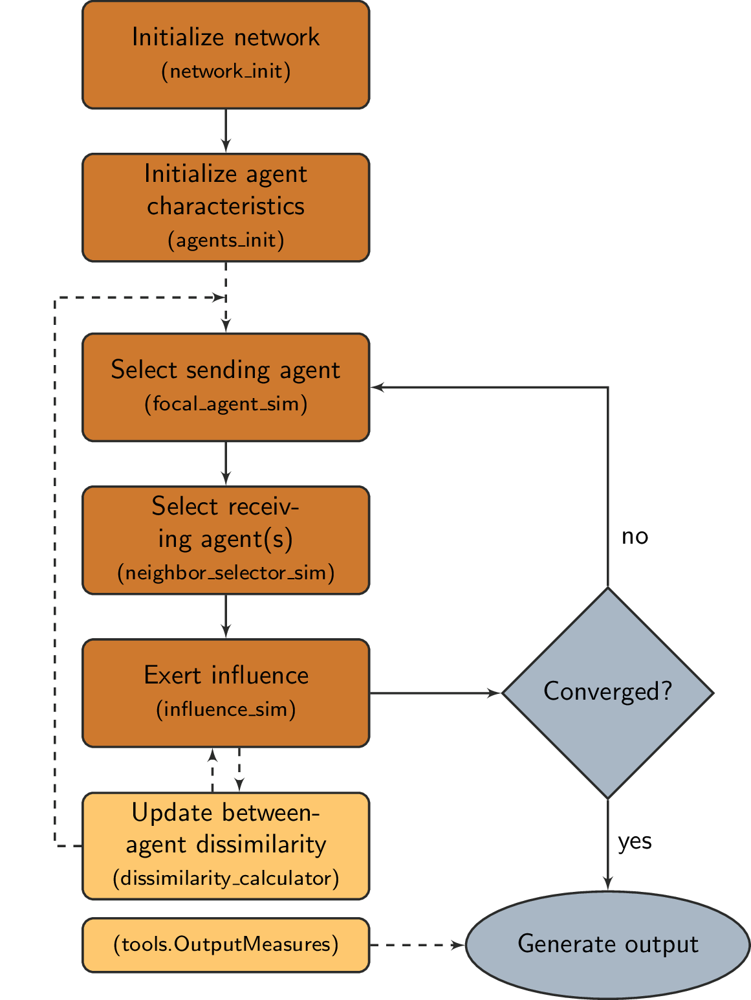

.. defSim documentation master file, created by
   sphinx-quickstart on Sat Jun 22 17:14:28 2019.
   You can adapt this file completely to your liking, but it should at least
   contain the root `toctree` directive.

Welcome to defSim's documentation!
==================================

Here you can find the API documentation for the *discrete event framework for social influence models*. The package is freely `available on GitHub <https://github.com/marijnkeijzer/defSim>`_.

defSim is a package that aims to be the modular standard for social influence models. With defSim you can run a single :class:`~defSim.Simulation`, execute a larger Simulation :class:`~defSim.Experiment`, or use any number of pre-programmed modules for your own idea or variation of a traditional social influence model. By using defSim you save a lot of time programming functions that you will need in any social influence research project, but furthermore you make sure that your model remains strictly comparable with traditional models, and other models in the defSim-realm, while working completely **open source by default**.

The flow of a single simulation run implemented by defSim looks like this:  

All elements on the left represent the separate modules.

The :class:`~defSim.Simulation` class handles the execution of all modules as depicted in the flow chart, and returns a single row of results as a Pandas dataframe. The :class:`~defSim.Experiment` class handles multiple executions of the simulation class, calling the simulation class effectively a number of times (repetitions) for every user-given parameter combination. Alternatively, you might want to use just one of a couple of the pre-programmed modules, and use your own code to create a variation on the traditional social influence models.

:doc:`Learn the basics of defSim on our introduction page <Introduction_to_defSim>`

................................................................................

Contents of the documentation
=============================

.. toctree::
   
   Introduction <Introduction_to_defSim>
   

.. toctree::
   
   Experiment class <experiment.class>
   Simulation class <simulation.class>
   Networks <defSim.network_init>
   Agent features <defSim.agents_init>
   Focal agent selection <defSim.focal_agent_sim>
   Neighbor selector <defSim.neighbor_selector_sim>
   Influence <defSim.influence_sim>
   Network evolution <defSim.network_evolution_sim>
   Dissimilarity updaters <defSim.dissimilarity_component>
   defSim.tools
   Credits <credits>

................................................................................

Indices and tables
==================

* :ref:`genindex`
* :ref:`modindex`
* :ref:`search`
