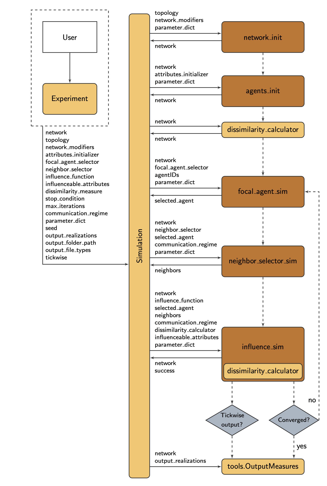

================
Modules overview
================

................................................................................

Core modules
############

distinction between 'init' and 'sim' modules

network_init
------------

agents_init
-----------

focal_agent_sim
---------------

neighbor_selector_sim
---------------------

influence_sim
-------------

................................................................................

Other modules
#############

dissimilarity_calculator
------------------------

tools
-----

network_evolution_sim
---------------------

